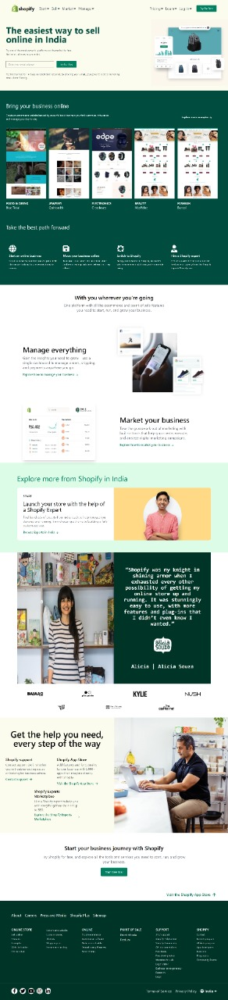

# Shopify Home Page Clone

## I have created home page clone of Shopify website using HTML and Tailwind.
## Mostly I used Tailwind for this project.

## Technology Used
  - ` HTML `
  - ` Tailwind `

### My Website is Fully Responsive , you can view in mobile , tab or desktop.

Live Link:-[Click Here](https://shopify-home-page-clone.netlify.app/)

### For making this web page responsive mostly I used flex box and grid.

### It took approx 8 hours to completed.

